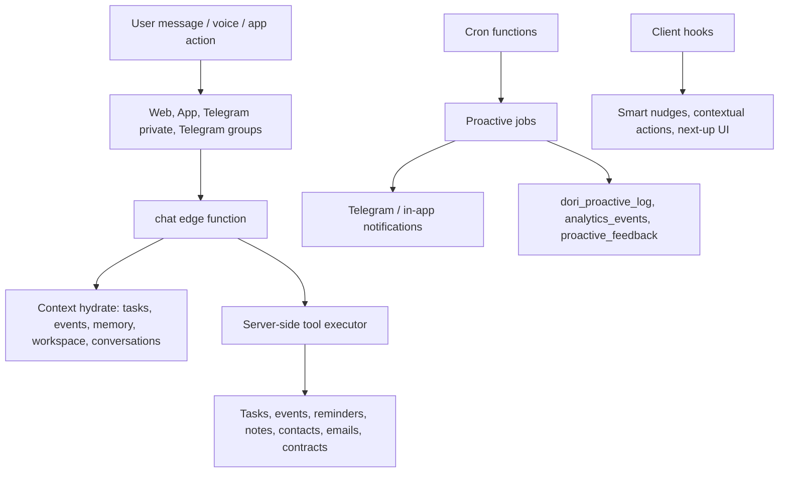

# Personal Assistant Intelligence And Proactivity Report

Date: 2026-06-18

## Executive Summary

The assistant is already broad: it can chat on the web/app and Telegram, handle tasks, calendar events, reminders, notes, contacts, contracts, emails, workspace/family context, voice, memory, briefings, nudges, and Content Studio ideas.

The main problem is that intelligence is split across many separate systems:

- `chat` has a large contextual prompt and tool executor.
- Telegram has its own private/group routing and proactive jobs.
- Web/mobile has smart nudges, contextual actions, next-up strips, and action cards.
- Scheduled functions run their own rules for briefings, meeting prep, content ideas, recaps, email autopilot, routines, and memory rollups.
- Feedback is recorded in some places, but it is not yet used as one central learning signal.

That means Dori can be useful in many situations, but there is no single "brain" deciding what matters most right now, whether the user should be interrupted, which channel to use, and how past user reactions should change future behavior.

The recommended next step is a central Opportunity Engine: collect possible proactive actions, score them with a consistent algorithm, apply safety/quiet/channel gates, deliver only the best ones, and learn from accept/dismiss/mute outcomes.

## What Was Fixed In This Pass

The content-suggestion delivery path had real reliability bugs. These are fixed now:

- Scheduled Content Studio generation no longer requires the cron tick to land inside the exact 15-minute delivery bucket. If `deliver_at` has passed and the user has not received today's batch, the job can recover later the same day.
- `content-ideas-cron` no longer stamps `creator_profiles.last_generated_on` before delivery is known to have worked.
- Telegram delivery is now checked message-by-message; failed Telegram sends are not silently ignored.
- Push/in-app delivery is now checked from the response body, not just HTTP status.
- `send-push-notification` now creates in-app notifications even when the user has no native push token. Before this, the function returned early and did nothing.
- Manual "generate today's ideas" now uses the user's local date from `user_location_settings.timezone` or `profiles.timezone`, instead of UTC.
- The Content Studio UI now labels today's batch using the browser's local date instead of UTC.

Verification:

- `npm run typecheck` passed.
- `npm test -- src/lib/content.test.ts src/lib/assistantContent.test.ts` passed: 2 files, 16 tests.
- `deno check supabase/functions/content-ideas/index.ts supabase/functions/content-ideas-cron/index.ts supabase/functions/send-push-notification/index.ts` passed.
- `npm run lint` passed with two pre-existing warnings in unrelated Telegram/shared files.

## What Likely Happened With The Missing Content Suggestions

The scheduler itself is wired:

- `cron/scheduler.mjs` includes `content-ideas-cron` every 15 minutes.
- `supabase/config.toml` disables gateway JWT for `content-ideas-cron`, and the function performs its own service-role check.

The failure was more likely one or more of these:

1. The cron tick missed the exact delivery window.
   The old logic required the local hour and 15-minute bucket to match `deliver_at`. If the scheduler/runtime was late, the user was skipped for the rest of that local day.

2. The daily marker was advanced before notification delivery.
   The old cron persisted ideas, stamped `last_generated_on`, then attempted Telegram and push. If Telegram failed, the function still counted it as sent and the user would not be retried that day.

3. Telegram send results were ignored.
   `tgSend()` returned `false` on failure, but the cron loop did not check the boolean result.

4. Push was not really push and could be a no-op.
   `send-push-notification` says it is in-app-only, but if no push token existed it returned before inserting a `user_notifications` row. A user with `push` selected could receive nothing.

5. Manual generation used UTC while cron used local dates.
   This could make the app and scheduled job disagree about what "today" means for users outside UTC.

6. Telegram may be selected without an active Telegram link.
   The cron now records that as a delivery warning. If push is also selected and works, the user still gets the batch in-app. If Telegram is the only selected channel and no active link exists, the run fails before spending LLM quota.

## Current Assistant Architecture



Important systems already present:

- Short-term conversation state: `dori_conversation_state`.
- Semantic memory foundation: `dori_semantic_memories` and `match_semantic_memories`.
- Task learning: `dori_task_stats` and `dori_slip_risk`.
- Proactive settings: quiet hours, focus mode, Telegram proactive enablement, voice preference, meeting reminders, prayer/contact/birthday/email options.
- Client telemetry: proactive impressions and accept/dismiss/mute outcomes go into `analytics_events`.
- Explicit proactive feedback: `proactive_feedback` exists.

## What Is Good Already

The assistant has a strong tool surface. It can maintain calendar and tasks, create and update events, set reminders, draft emails, handle contacts and contracts, use workspace context, and operate through Telegram.

The Telegram path is much better after the previous Telegram work:

- Private text routes to the main assistant.
- Voice can be transcribed and answered.
- Replies can be chunked for Telegram limits.
- German command/help support and group wake/action detection were improved.
- Workspace group context exists.
- Webhook security and diagnostics are stronger.

The proactivity foundation is also real:

- `dori-proactive` can send morning briefs, meeting prep, contract reminders, birthday reminders, prayer reminders, stale-contact nudges, and email action items.
- `meeting-prep`, `meeting-followup`, `morning-thread`, `briefing-dispatch-cron`, `workspace-recap-cron`, and Content Studio all create useful scheduled assistance.
- `useSmartNudges`, `useContextualActions`, `NextUpStrip`, `WhatNowButton`, and `AgentActionInbox` make the app feel proactive.

## What Is Not Intelligent Enough Yet

### 1. No Global Ranking Layer

Each proactive system decides for itself whether to send something. There is no shared priority queue. If three things are relevant at once, the system does not globally decide which is most valuable and least disruptive.

### 2. Feedback Is Not Closing The Loop

The app records proactive outcomes, and Telegram has `proactive_feedback`, but the scheduled jobs do not consistently use those signals to change frequency, channel, wording, or timing.

### 3. Delivery Observability Is Too Thin

For content ideas, there was no per-channel delivery row. `last_generated_on` mixed generation and delivery semantics. That made it hard to answer "was it generated, delivered, failed, skipped, or suppressed?"

### 4. Some Cron Jobs Still Use Fragile Exact Windows

Content ideas are fixed now. Other jobs, especially briefings, still use exact 15-minute bucket logic and should be changed to "after scheduled time and not sent today."

### 5. Push Naming Is Misleading

`send-push-notification` is currently in-app-only. It logs that APNs/FCM are not configured. That is fine if intentional, but the product should either wire real native push or rename the channel/UX to "in-app".

### 6. Proactive Counters And Logs Need Cleanup

`dori-proactive` has a `sent` variable but resets it back to `before`, so the returned count is not useful. It logs sent messages but not skipped candidates, rejected candidates, channel failures, or model decisions.

### 7. Telegram Group Proactivity Needs More Etiquette

Groups should have a stricter policy than private chats:

- Only speak when addressed, when a group action is clearly needed, or when the group explicitly opted into a digest.
- Prefer short messages and inline buttons.
- Avoid exposing private user context in group chats.
- Track group-specific cooldowns and mute behavior.

### 8. German Support Needs Product-Level Tests

The model can understand German, and some Telegram German support exists, but critical workflows need deterministic tests:

- "Erinnere mich morgen um 9 an Mama."
- "Trag Zahnarzt nächsten Freitag um 14 Uhr ein."
- "Verschieb den Termin auf nächste Woche."
- "Mach das rückgängig."
- "Schick mir die Content-Ideen jeden Morgen auf Telegram."

## Proposed Algorithm: Dori Opportunity Engine

The assistant should generate many possible proactive actions, score them, gate them, and deliver only the best. The model should help write and interpret, but the decision layer should be deterministic enough to debug.

### Candidate Generation

Every 5-15 minutes, generate candidates from:

- Tasks: overdue, due soon, high slip risk, blocked tasks, quick wins.
- Calendar: meeting prep, travel time, conflicts, open focus windows, follow-ups.
- Email: urgent unanswered questions, invoices, clear todos.
- Contacts: stale relationships, birthdays, promised follow-ups.
- Content Studio: daily ideas, script follow-up, scheduling nudges.
- Workspace/family: unassigned items, group decisions, upcoming shared events.
- Memory: goals, preferences, promises, recurring routines.
- Health/habits/prayer: only if explicitly enabled.

Each candidate should be a structured object:

```json
{
  "type": "task_slip_risk",
  "title": "Finish proposal before it slips",
  "user_id": "uuid",
  "entities": [{ "type": "task", "id": "..." }],
  "actionability": 0.9,
  "urgency": 0.8,
  "impact": 0.7,
  "confidence": 0.85,
  "preferred_channels": ["telegram_private", "in_app"],
  "expires_at": "2026-06-18T18:00:00Z"
}
```

### Scoring

Use a transparent formula:

```text
score =
  100
  * utility
  * confidence
  * timing_fit
  * user_receptivity
  * novelty
  - interruption_cost
  - duplicate_penalty
  - risk_penalty
```

Where:

- `utility = weighted(urgency, impact, actionability)`.
- `confidence` comes from deterministic evidence and model extraction confidence.
- `timing_fit` uses timezone, quiet hours, current event state, focus mode, and known productive hours.
- `user_receptivity` comes from accept/dismiss/mute history by type, channel, and time.
- `novelty` suppresses repeated advice.
- `interruption_cost` is higher during meetings, focus, late night, and group chats.
- `risk_penalty` is higher for private, financial, destructive, medical, or ambiguous actions.

### Gates

Before delivery, candidates must pass gates:

- User opted in to this proactive domain.
- Not inside quiet hours or focus mode unless urgent and explicitly allowed.
- Not during an event if `suppress_during_events` is enabled.
- No duplicate was sent recently.
- Confidence is high enough.
- Sensitive actions require confirmation.
- Group messages pass a stricter privacy and relevance policy.
- Telegram is linked and active if Telegram is selected.

### Channel Policy

Private Telegram:

- Use for urgent, time-sensitive, actionable items.
- Use inline buttons for accept, dismiss, remind later, create task, schedule.
- Use voice only if the user prefers voice or sent voice first.

Telegram groups:

- Use only group-scoped context.
- Prefer summaries, decisions, assignments, and reminders that affect the group.
- Avoid private memory, private calendar, and private contact details.

In-app:

- Use for lower-priority ideas, dashboards, and review queues.
- Store everything in an inbox so the user can review missed suggestions.

Native push:

- Only after real APNs/FCM delivery is implemented.
- Until then, label it clearly as in-app notification.

### Learning Loop

Every delivery should record:

- Candidate ID.
- Score and features.
- Gates passed/failed.
- Channel selected.
- Message variant.
- Delivery result.
- User reaction: accepted, dismissed, muted, ignored, replied, converted into action.

Then update:

- Best time of day per user and domain.
- Preferred channels per domain.
- Frequency limits.
- Wording style.
- Trigger thresholds.

## Data Model Recommendation

Add a small set of central tables:

```sql
-- Generated possibilities before delivery.
dori_opportunity_candidates (
  id, user_id, type, entity_refs, payload, features, score,
  status, created_at, expires_at
)

-- Final decision for each candidate.
dori_opportunity_decisions (
  id, candidate_id, user_id, decision,
  reason, gates, selected_channel, created_at
)

-- Per-channel delivery attempts.
dori_channel_deliveries (
  id, candidate_id, user_id, channel,
  status, provider_response, sent_at, failed_at
)

-- Learned receptivity by user/type/channel/time.
dori_receptivity_stats (
  user_id, opportunity_type, channel, hour_bucket,
  shown_count, accepted_count, dismissed_count, muted_count,
  last_updated_at
)
```

For Content Studio specifically, add either:

- `content_idea_deliveries`, or
- a generic `dori_channel_deliveries` row with `candidate.type = content_ideas_daily`.

This separates "ideas were generated" from "Telegram delivered" from "push/in-app delivered."

## Implementation Roadmap

### Phase 1: Reliability And Observability

- Add per-channel delivery logs.
- Add admin/debug view for "why did/didn't Dori send this?"
- Change remaining exact-window cron jobs to recover after missed ticks.
- Fix misleading push UX or wire real native push.
- Add health checks for Telegram link status, webhook status, and content delivery status.

### Phase 2: Central Opportunity Engine

- Build candidate schema and scoring function.
- Move task risk, meeting prep, contact reminders, content ideas, and email actions into candidate generators.
- Deliver through one channel adapter layer.
- Keep existing jobs as generators until the new engine is stable.

### Phase 3: Feedback-Based Learning

- Consume `analytics_events` and `proactive_feedback`.
- Update receptivity stats nightly and in near-real time.
- Lower scores for dismissed/muted types.
- Increase confidence for accepted/actioned suggestions.

### Phase 4: Telegram-First UX

- Add "Today" and "What now?" Telegram shortcuts.
- Add inline buttons to content ideas: like, dismiss, write script, schedule.
- Add German command menus and German-specific golden tests.
- Add group-specific policies and cooldowns.

### Phase 5: Evaluation

- Build test fixtures for English and German task/calendar/content flows.
- Add simulated-user tests for proactive scoring.
- Add delivery tests for Telegram unavailable, push unavailable, both unavailable, and partial success.
- Add regression tests for timezone boundaries.

## Recommended Next Work

1. Add `dori_channel_deliveries` and wire Content Studio into it.
2. Fix `briefing-dispatch-cron` to use the same "after deliver_at and not sent today" recovery logic.
3. Create the first `dori-opportunity-engine` function with two generators: task slip risk and content ideas.
4. Add Telegram inline actions for content ideas.
5. Wire `proactive_feedback` and `analytics_events` into a receptivity rollup.
6. Decide whether `push` means real native push or in-app notification, then make the UX and code match.

