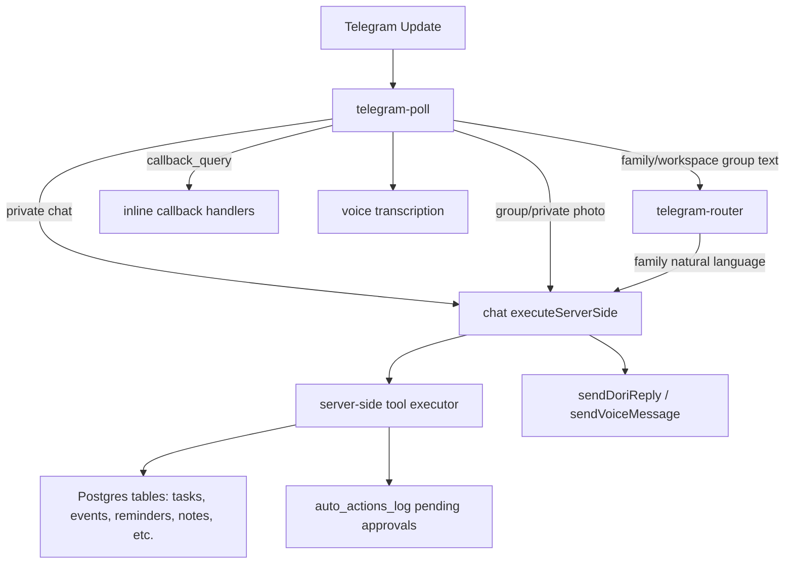

# Telegram Assistant Report

Date: 2026-06-18

## Executive Summary

The Telegram integration is already substantial. It supports personal 1:1 chat, family group linking, workspace group linking primitives, text messages, voice messages, photos, documents, inline keyboards, undo, approvals, daily digests, voice digests, command registration, and diagnostics. The core assistant can maintain tasks, events, reminders, notes, contacts, contracts, email drafts, family messages, polls, memory, and more.

## Implementation Update

Implemented on 2026-06-18:

- Workspace-linked group text now resolves through `workspace_telegram_links` in `telegram-router` instead of failing the family-group-only check.
- Telegram chat context now supports `tg_workspace`, `channel_ref`, and workspace-scoped short-term state via migration `20260618120000_telegram_workspace_context.sql`.
- Telegram `chat` calls now preserve `tg_private`, `tg_family`, and `tg_workspace` channel headers and action sources, including queued approval replay metadata.
- Telegram voice input now uses a shared STT helper: OpenAI Whisper first, Gemini native audio `generateContent` fallback, Telegram file-size preflight, and transcript metadata.
- Telegram voice output now prefers MP3 for `sendVoice`; Gemini WAV is sent as `sendAudio` fallback instead of pretending WAV is a voice-note format.
- Long Telegram text replies now use chunking in shared send helpers and placeholder-edit paths.
- Webhook mode now requires `TELEGRAM_WEBHOOK_SECRET` unless `DORI_ALLOW_UNSECURED_TELEGRAM_WEBHOOK=true` is explicitly set for development.
- Telegram diagnostics now report `getWebhookInfo`, webhook secret presence, and user-scoped workspace Telegram links.
- Command registration now supports scoped private/group command menus, German command descriptions, and optional workspace chat-specific command registration.
- Private and group help now have German variants selected from `profiles.locale`.
- Group wake/action detection now includes high-frequency German productivity phrases.

Verification:

- `npm test -- src/lib/telegramCommands.test.ts src/lib/telegramControl.test.ts src/lib/telegramQuick.test.ts src/lib/actionRisk.test.ts` passed: 4 files, 28 tests.
- `npm run typecheck` passed.
- `deno check` passed for the edited isolated Telegram shared helpers and command registrar.
- A full edge-function `deno check` still reports many pre-existing typing issues in older shared Supabase helper surfaces and tool schemas; it is not yet a clean repo-wide verifier.

The original audit found the issues below. The implementation update above addresses the core routing, context, voice, webhook, diagnostics, chunking, and bilingual Telegram UX items in code; live Telegram/Supabase validation is still needed before calling the integration production-complete.

1. Workspace-linked groups appeared broken for normal text messages.
2. Incoming voice transcription needed to move to a supported, shared STT path.
3. Outgoing voice needed Telegram-compatible voice/audio formats.
4. Context needed tighter chat/workspace scoping.
5. German support needed to extend beyond model language ability into Telegram commands, help, and routing.
6. Production Telegram webhooks needed mandatory shared-secret verification.
7. UX was powerful but too command-heavy for a single global Telegram command menu.

## Inspected Code Paths

- `supabase/functions/telegram-poll/index.ts`: webhook/poll entry point, private chat path, group filtering, voice/photo/document intake, streaming placeholder edits, callback handling.
- `supabase/functions/telegram-router/index.ts`: linked family group command router and group natural-language handoff into `chat`.
- `supabase/functions/chat/index.ts`: assistant prompt, context hydration, model calls, server-side tool execution, confirmation gate, memory/state persistence.
- `supabase/functions/_shared/telegram-voice.ts`: outgoing Telegram voice/text helper.
- `supabase/functions/_shared/telegram-confirm.ts`: Telegram approvals and confirmation callbacks.
- `supabase/functions/_shared/telegram-inline.ts`: inline keyboard callback encoding.
- `supabase/functions/_shared/telegram-commands.ts`: registered command list and validation.
- `supabase/functions/_shared/telegram-control.ts`: cockpit, quick commands, steering commands.
- `src/components/settings/TelegramHubPanel.tsx`: settings UX for personal and family Telegram linking.
- Relevant tests: `src/lib/telegramCommands.test.ts`, `src/lib/telegramControl.test.ts`, `src/lib/telegramQuick.test.ts`, `src/lib/actionRisk.test.ts`.

Focused tests now run after installing local dependencies: 4 Telegram/action test files pass with 28 tests.

## Current Architecture



Important note: the diagram shows intended flow. The workspace group text path currently falls into `telegram-router`, but that router only resolves `telegram_group_links`, not `workspace_telegram_links`.

## Requirement Assessment

### 1. Understand Text Messages

Status: mostly implemented, but needs reliability fixes.

What works:

- Private text goes directly to `chat` with `executeServerSide: true`, so Dori can run tools instead of only answering conversationally.
- Private chat can scope work to a workspace with `/workspace <name>`.
- Family groups use filters to avoid responding to normal chatter: mentions, wake words, replies to the bot, slash commands, voice/audio, photos, or action keywords.
- The assistant has a large live context block with current tasks/events and timezone.
- Forwarded messages are annotated as third-party content so the model should not silently create tasks from someone else's message.

Gaps:

- Workspace group text is probably broken:
  - `telegram-poll` checks `workspace_telegram_links`.
  - If the group is linked only as a workspace, `wsLink` exists and `glink` is null.
  - `telegram-poll` sends text to `telegram-router` with `workspace_id`.
  - `telegram-router` immediately queries `telegram_group_links` and returns "This group is not linked to a Dori family space yet" if no family link exists.
- Group action keyword detection is English-first with only a few German words: `kaufen`, `brauchen`, `besorgen`, `erinner`, `termin`, `morgen`, `heute`.
- Group behavior depends on Telegram privacy mode. Telegram bots in groups see only relevant messages by default unless admin or privacy mode disabled. That means "action keyword" detection will not work for ordinary unmentioned group messages unless the bot can actually receive them.
- Message truncation is handled by slicing many replies to 4000 characters, but `chunkForTelegram` exists and is not consistently used. Important replies can be silently cut.

What to change:

- Route workspace group text directly to `chat` or teach `telegram-router` to resolve `workspace_telegram_links` first.
- Add an explicit group routing matrix:
  - private personal
  - private workspace-scoped
  - family group
  - workspace group
  - photo/doc in each
  - callbacks in each
- Expand German routing keywords and use locale-aware intent detection rather than regex-only English heuristics.
- Use chunking for long Telegram replies.

### 2. Understand Voice Messages

Status: implemented but risky.

What works:

- `telegram-poll` detects `msg.voice` and `msg.audio`.
- It downloads the Telegram file through `getFile`.
- It transcribes the audio and injects the transcript into `msg.text`, so the rest of the assistant path treats voice like text.
- If a user sent voice, Dori tends to reply with voice.

Gaps:

- The current transcription implementation calls `https://generativelanguage.googleapis.com/v1beta/openai/chat/completions` and passes audio as an `image_url` data URL. Official Gemini audio examples use Gemini audio input with `generateContent` and `file_data`, while OpenAI-compatible examples show `image_url` for images and function-calling/chat use cases.
- There is already a `voice-to-text` function using OpenAI Whisper (`whisper-1`) for web/app voice, but Telegram uses a different inline Gemini path. This fragments behavior, observability, quotas, and language detection.
- Telegram file download has a 20 MB Bot API download limit. The current code does not preflight voice/document size before downloading.
- Transcripts are not sent back or logged in a structured way for user correction. When voice mishears German names, dates, or task titles, correction UX matters.

What to change:

- Replace `transcribeTelegramVoice` with a shared transcription service:
  - preferred: a `telegram-voice-to-text` helper using Gemini `generateContent` audio input or existing OpenAI STT, with provider fallback.
  - return `{ transcript, language, confidence, duration, provider, error }`.
- Persist transcript metadata in `telegram_messages` or a dedicated `telegram_voice_transcripts` table.
- For low confidence or short ambiguous transcripts, ask a clarifying question before mutating data.
- Add language-specific transcript normalization for German dates, names, and compounds.

### 3. Respond To Voice Messages

Status: implemented but format needs correction.

What works:

- Personal voice replies are controlled through `proactive_settings.prefer_voice_replies` and `/voice on|off`.
- Family group voice replies are controlled through `telegram_group_links.voice_replies_enabled`.
- Voice digests use `sendVoiceMessage` and send a text companion for details.
- TTS selects different Gemini voices by locale, including German.

Gaps:

- `sendVoiceMessage` generates WAV and uploads it as `voice` to Telegram. Telegram voice messages should be in a supported voice-message format such as OGG/OPUS, MP3, or M4A.
- The helper sends only short replies as voice; longer replies fall back to text. That is reasonable, but the UX should explicitly support "send as audio summary" for longer content.
- Voice captions are limited and can duplicate text depending on caller choices.

What to change:

- Generate `ogg/opus`, `mp3`, or `m4a` for `sendVoice`; if the provider only returns PCM/WAV, transcode before upload or use `sendAudio` as fallback.
- Add a provider-agnostic TTS helper with output format selection.
- Add tests for:
  - voice reply preference in private
  - group voice toggle
  - voice digest text companion
  - fallback text on TTS failure
  - German locale voice selection

### 4. Maintain Calendar, Tasks, Reminders, And Productivity Data

Status: strong tool coverage, but confirmation/risk and routing need cleanup.

What works:

- Task tools: add, update, complete, delete, tags, estimates, subtasks, assignments, filters, duplication.
- Calendar tools: schedule events, update/delete/search/list events, recurrence rules, recurrence exceptions, free-time search, conflict warning, workspace assignees.
- Reminders: `set_reminder` supports one-off and recurring reminders.
- Notes, contacts, contracts, email drafts/sends, family messages, polls, expenses, habits, goals, focus sessions, document summaries, translation, rewriting, daily recaps, and random picks are supported by the assistant prompt/executor.
- Undo exists through `dori_undo_log` and inline "Undo" buttons.
- Riskier actions can queue in `auto_actions_log` and get Telegram approval buttons.

Gaps:

- There are two action-risk systems:
  - `src/lib/actionRisk.ts` is pure client-side classification.
  - `chat/index.ts` has its own server-side `MUTATING_TOOLS` and `requiresConfirmation`.
    They are not obviously the same source of truth.
- Native tool calling exists but is opt-in via `x-dori-native-tools: 1`. Telegram calls do not set that header, so Telegram still relies on XML tool tags.
- Some tools advertised in the assistant prompt are not included in `NATIVE_TOOLS`, so native rollout is incomplete.
- The assistant prompt says "Any task with a date -> ALSO create a calendar event" because of a stated preference. That may be too aggressive globally unless user-specific memory proves it.

What to change:

- Move action risk classification to one shared server-enforced module and import it everywhere.
- Enable native function calling for Telegram after completing tool schema coverage.
- Add "dry-run" confirmation summaries for high-risk calendar/email/financial/medical actions.
- Create golden tests for English and German requests like:
  - "Remind me tomorrow at 9 to call Mama."
  - "Termin beim Zahnarzt nächsten Freitag um 14 Uhr."
  - "Move dentist to Friday."
  - "Delete the meeting." with multiple meetings.
  - "Mach das rückgängig."

### 5. Understand English And German

Status: partial.

What works:

- The model can naturally understand English and German.
- `/lang de|en` updates `profiles.locale`.
- The chat prompt has a locale block: respond in stored locale, mirror the user's language if they write differently.
- German confirmations are recognized (`ja`, `nein`, `mach das`, `abbrechen`, etc.).
- TTS voice selection has a German branch.
- Help text has a German tip.

Gaps:

- The Telegram command menu is English-only.
- Bot help text is mostly English.
- Group action detection is mostly English.
- Intent specialist routing is English-only regex.
- German date/time parsing depends on the LLM rather than tested deterministic coverage.
- There are no German Telegram tests in the visible test set.

What to change:

- Register command lists with `language_code: "de"` and concise German descriptions.
- Add bilingual help text chosen from `profiles.locale` and Telegram user language when available.
- Expand German examples in prompts and tests.
- Add an internal NLU normalization layer for high-frequency German productivity phrases:
  - "erinnere mich"
  - "trag ein"
  - "verschieb"
  - "lösche"
  - "einkaufsliste"
  - "Termin"
  - "Aufgabe"
  - "morgen früh"
  - "übermorgen"
  - "nächsten Freitag"

### 6. Understand Context

Status: good foundation, needs scoping and retrieval discipline.

What works:

- `buildDoriContext` injects current tasks, events, overdue count, workspace members, local clock, timezone, and upcoming events.
- `dori_conversation_state` tracks open intent and recent entities for pronoun resolution.
- `telegram-router` adds recent group messages and assistant replies for six-hour group context.
- `chat` hydrates recent same-channel turns from `dori_conversations` for Telegram surfaces.
- Semantic memory and learned preferences exist.

Gaps:

- `dori_conversation_state.Channel` is `web | tg_private | tg_family | voice`; there is no `tg_workspace`.
- `chat` maps any Telegram channel hint other than `tg_family` to `tg_private`. Workspace group calls from `telegram-router` use `x-dori-channel: tg_workspace`, so they are treated as private for memory hydration.
- Same-channel hydration queries by `user_id + channel`, not by `source_ref` / chat id. A user's separate private chat, family group, and workspace group follow-ups can cross-contaminate if the channel mapping is wrong.
- `telegram-router` group history uses `chat_id`, which is good, but it is separate from unified `dori_conversations`.

What to change:

- Add `tg_workspace` to `dori_conversation_state.Channel`.
- Hydrate conversation history with `channel_ref` when present.
- Store and query recent entities by `(user_id, channel, channel_ref, workspace_id)` instead of just `(user_id, channel)`.
- Add tests for pronoun resolution:
  - "move dentist to Friday" -> "actually make it 3pm"
  - group: "Dori, add shopping milk" -> "remove that"
  - workspace group: "assign launch deck to Sarah" -> "mark it done"

### 7. Help In Groups And Private Chats

Status: private is stronger than groups; groups need mode separation.

What works:

- Private: natural chat, voice, photos, docs, workspace scope, cockpit, approvals, memory, focus mode, undo.
- Family group: linking, `/linkme`, roster auto-accept by Telegram username, shared family digest, shopping list, group voice toggles, commands, inline cards.
- Workspace group primitives exist: `workspace_telegram_links`, `/linkworkspace`, `/standup`, `/recap`, `/comment`, `/schedule`.

Gaps:

- Workspace group text routing bug described above.
- Settings UI exposes personal and family group, but not workspace group setup, despite backend support.
- Group privacy mode is handled in copy, but not as a diagnostic check. Users may expect keyword capture without realizing Telegram never delivers those messages to the bot.
- The command menu is too large and not scoped. Family users see workspace commands; private users see group setup commands; German users see English.

What to change:

- Fix workspace group routing first.
- Add a "Workspace Telegram" setup flow in Workspace settings, not only text instructions.
- Add diagnostics for:
  - webhook registered and healthy via `getWebhookInfo`
  - bot privacy/admin status guidance
  - last update received
  - last reply sent
  - STT/TTS provider health
- Register different command scopes:
  - private chats: `/cockpit`, `/me`, `/now`, `/approvals`, `/memory`, `/workspace`, `/focus`, `/voice`
  - group chats: `/today`, `/tomorrow`, `/digest`, `/shopping`, `/standup`, `/recap`, `/schedule`, `/linkme`
  - admins: `/linkfamily`, `/linkworkspace`, diagnostics/setup commands

## Telegram UX Recommendations

### Make The First Screen In Telegram A Cockpit

`/cockpit` already exists. Make it the main onboarding destination after linking:

- Row 1: Today, Now
- Row 2: Add Task, Add Event
- Row 3: Voice On/Off, Focus
- Row 4: Approvals, Undo
- Row 5: Settings

Each button should either execute a deterministic command or prompt the user with an example. Avoid dumping the full command list by default.

### Show Confirmation Cards For Mutations

For creates/updates/deletes, the ideal Telegram UX is:

```text
I understood:
Task: Call dentist
When: Fri 14:00
Scope: Personal

[Confirm] [Edit time] [Cancel]
```

For low-risk operations, execute immediately but still include undo:

```text
Added: Call dentist, Friday 14:00
[Undo]
```

### Voice UX

For incoming voice:

```text
Heard: "Termin beim Zahnarzt nächsten Freitag um 14 Uhr"
Added event: Dentist, Fri 14:00
[Undo]
```

For ambiguous voice:

```text
I heard "meeting with Sara Friday at four", but I found Sarah K. and Sarah M.
Which Sarah?
[Sarah K.] [Sarah M.] [Skip attendee]
```

For outgoing voice:

- Short replies: voice note with concise caption.
- Long replies: text first, optional "Send audio summary" button.
- Digests: voice summary + text detail companion.

### Group UX

Group behavior should be explicit:

- Mention mode: reply only when mentioned or replied to.
- Action mode: also process clear tasks/events if bot has permission to read group messages.
- Quiet mode: slash commands only.

Expose this as a group setting, not only a BotFather/privacy-mode instruction.

## Production Readiness Risks

### Critical

1. Workspace group natural-language routing.
2. Telegram voice output format.
3. Telegram voice transcription provider path.
4. Required webhook secret in production.
5. Context scoping by chat id and workspace.

### High

1. Native tool calling not enabled for Telegram.
2. Server/client action-risk policy drift.
3. Long responses truncated instead of chunked.
4. German coverage not tested.
5. Diagnostics still focus on cron even though production replies use webhooks.

### Medium

1. Command menu too large and not scoped/localized.
2. PDF extraction is regex-based and weak for real documents.
3. `telegram_messages.raw_update` may retain more personal data than necessary.
4. Preview model used as primary for production Telegram.
5. No automated end-to-end Telegram fixture harness.

## Implementation Plan

### Phase 0: Stabilize Telegram Core

Target: 1-2 days.

- Fix workspace group routing:
  - Option A: split `telegram-router` into family and workspace branches.
  - Option B: bypass router for workspace group text and call `chat` directly from `telegram-poll`.
- Add `tg_workspace` as a first-class channel and scope history by `channel_ref`.
- Make `TELEGRAM_WEBHOOK_SECRET` required when `APP_ENV !== "development"`.
- Update diagnostics to check `getWebhookInfo`, not only `telegram_bot_state` / cron recency.
- Use `chunkForTelegram` in all send paths.

### Phase 1: Fix Voice

Target: 2-4 days.

- Replace inline `transcribeTelegramVoice` with a shared STT module.
- Implement provider fallback:
  - primary: chosen production STT provider
  - fallback: alternate provider
  - clear error surfaces
- Add language detection result and confidence.
- Convert TTS output to Telegram voice-compatible OGG/OPUS, MP3, or M4A.
- Add voice test fixtures for English and German.

### Phase 2: Make Telegram Bilingual

Target: 3-5 days.

- Localize command lists using Telegram `language_code`.
- Localize `/help`, `/cockpit`, confirmation prompts, and error messages.
- Add German NLU fixtures and group keyword detection.
- Add language-specific examples to onboarding and Settings.
- Add "reply in same language unless profile locale says otherwise" tests.

### Phase 3: Tool Reliability And Safety

Target: 1 week.

- Turn on native function-calling for Telegram once tool schemas cover all critical tools.
- Consolidate action-risk rules into one shared server-enforced source.
- Add golden action tests:
  - user text -> expected tool(s)
  - confirmation required or not
  - database mutation expected
  - reply text expected
- Improve confirmation cards for destructive/outward-facing actions.
- Add audit records for every Telegram-origin mutation.

### Phase 4: Product-Grade Group UX

Target: 1 week.

- Add Workspace Telegram settings UI.
- Add group behavior mode: mention-only, action-detect, slash-only.
- Add admin/permission diagnostics and privacy-mode guidance.
- Add group member resolution UX for unlinked users.
- Add topic/thread support for supergroups if the target users use topics.

### Phase 5: Evaluation Harness

Target: ongoing.

Create a local test harness that replays Telegram update JSON into `telegram-poll` with mocked Telegram API and Supabase.

Minimum matrix:

- Private text EN/DE.
- Private voice EN/DE.
- Private photo receipt/calendar screenshot.
- Family group text with mention.
- Family group actionable message.
- Workspace group text.
- Confirmation buttons.
- Bare "yes/no/ja/nein".
- Undo.
- Long replies.
- STT/TTS failures.
- Webhook spoof attempt.

## Concrete Backlog

| Priority | Item                                       | Why                                                              |
| -------- | ------------------------------------------ | ---------------------------------------------------------------- |
| P0       | Fix workspace group text routing           | Workspace Telegram groups cannot be trusted until this is fixed. |
| P0       | Replace WAV `sendVoice` upload             | Telegram voice replies may fail or render incorrectly.           |
| P0       | Replace audio-as-`image_url` transcription | Unsupported/fragile path for core voice input.                   |
| P0       | Require webhook secret in production       | Prevent spoofed Telegram updates.                                |
| P1       | Add chat-ref scoped memory                 | Prevent context bleed across Telegram chats.                     |
| P1       | Use `chunkForTelegram` globally            | Prevent silent truncation.                                       |
| P1       | Add German fixtures                        | Product requirement is bilingual, not "model probably can".      |
| P1       | Enable native tools for Telegram           | Reduces XML parsing risk and malformed tool calls.               |
| P1       | Update diagnostics for webhooks            | Current UI still implies cron health for replies.                |
| P2       | Scoped/localized command menus             | Better Telegram UX and lower command overload.                   |
| P2       | Workspace Telegram settings UI             | Backend support needs visible onboarding.                        |
| P2       | Improve document extraction                | Current PDF regex is not enough for real contracts/statements.   |

## Official Platform Notes

- Telegram Bot API supports long polling through `getUpdates` and webhooks through `setWebhook`. Registering a webhook disables `getUpdates`; the repo's production webhook approach is correct.
- Telegram webhook `secret_token` is the right authenticity check for incoming webhook calls.
- Telegram Bot API `getFile` downloads are limited to 20 MB on the public Bot API.
- Telegram bot commands are limited to 1-32 lowercase/digit/underscore characters, descriptions 1-256 characters, and at most 100 commands per command list.
- Telegram privacy mode is enabled by default for group bots; with privacy mode, bots only see commands meant for them, replies to them, and certain relevant messages. Keyword-based group behavior requires the bot to receive those messages.
- Telegram supports command menus and command scopes, including language-specific command lists.
- Gemini audio understanding supports transcription/summarization of audio through the Gemini audio input APIs; official examples use `generateContent` with audio/file parts. Gemini's OpenAI-compatible docs show chat, streaming, function calling, and image input via `image_url`.

Sources:

- Telegram Bot API: https://core.telegram.org/bots/api
- Telegram Bot features and privacy mode: https://core.telegram.org/bots/features
- Gemini audio understanding: https://ai.google.dev/gemini-api/docs/audio
- Gemini OpenAI compatibility: https://ai.google.dev/gemini-api/docs/openai

## Recommended Definition Of Done

Telegram should be considered "fully working" only when this passes:

1. A linked private user can send English and German text to create, update, complete, undo, and query tasks/events/reminders.
2. The same user can send English and German voice notes and receive accurate action execution or clarifying questions.
3. A private user can enable voice replies and receive Telegram-native playable voice notes.
4. A linked family group can process mentions, replies, slash commands, photos, shopping items, events, and morning digests without spam.
5. A linked workspace group can process standups, scheduling, task comments, task assignment, and natural-language productivity requests.
6. Contextual follow-ups work inside the same chat and do not leak across different Telegram chats.
7. Destructive/outward-facing actions require approval and support cancel/undo.
8. Diagnostics can identify webhook, Telegram token, STT, TTS, link, group, and permissions failures.
9. The command menu is scoped and bilingual.
10. The automated Telegram fixture suite passes in CI.
